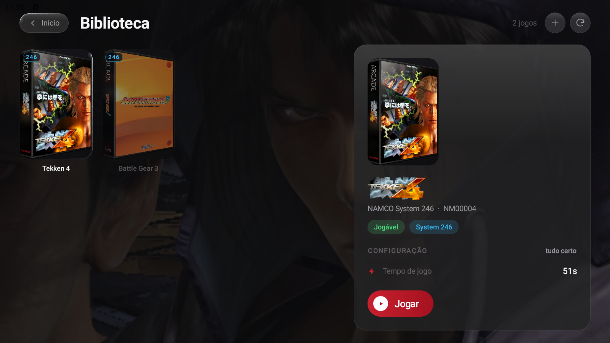
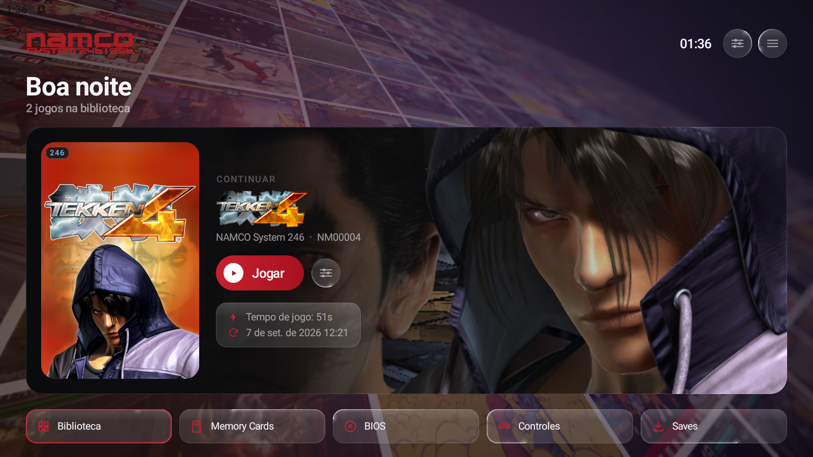
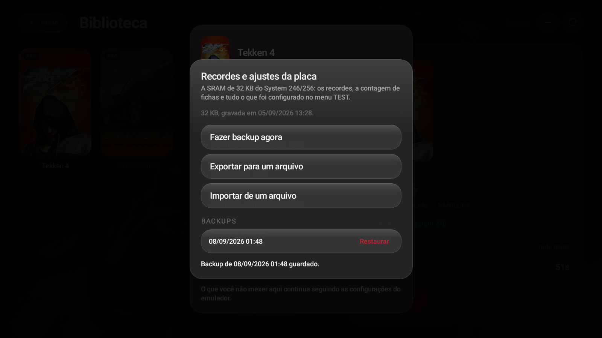

# Namco System 246 EMU

An Android emulator for the **NAMCO System 246 / 256** arcade boards — the PlayStation 2 hardware
Namco put in cabinets between 2001 and 2008, running Tekken 4 and 5, Soulcalibur II and III, Time
Crisis 3 and 4, Ridge Racer V, Wangan Midnight, the Taiko drum games and about fifty others.

Not a PS2 emulator with an arcade mode bolted on. It boots `.acgame` manifests, talks to an
emulated JVS I/O board, keeps the cabinet's battery-backed SRAM, and has no idea what a DualShock
is.

---

## What it does

**The board**
- System 246 and System 256, from a COH-H BIOS
- ACATA / ACATAPI: the cabinet's CD, DVD and HDD, read from `.chd`
- ACJV: the JVS I/O board — coin, START, TEST, SERVICE, and the per-game control layout
- ACSRAM: the 32 KB of battery-backed memory where the high scores and the TEST-menu settings live
- ACRAM, ACUART, ACDEV: the RAM expansion, the drive-board serial link, the COH-H ROM window
- ARM64 recompilers for the EE, the IOP and both VUs, taught the 128 MB map an arcade boot asks for

**The cabinet, on a phone**
- Cabinet switches on screen and on a gamepad, per player — the second seat gets its own coin slot
- Six control modes, chosen from the game id: standard, fighting, driving, lightgun, drum, twin-stick
- The analog stick standing in for the cabinet's lever, because a JVS panel's directions are switches
- Steering with a deadzone and sensitivity you can set, or by tilting the phone
- Lightgun aiming by touch or by pointing the phone
- Taiko drums, four columns, on screen or on the shoulder buttons
- Haptics for the drum, the gun, the coin and the switches

**The launcher**
- A wizard that writes the `.acgame` manifest for you, and a repair that fixes a broken one
- A pre-flight check that says what a game is missing *before* the board black-screens
- Install from `.zip` or `.7z` — one archive, a whole folder of them, or straight from a PC browser
  over the local network
- The project's compatibility list, bundled: 55 titles with board, media, state and notes
- 246 / 256 board badges on the cover, rendered arcade box art fetched by game id, game logos,
  cabinet bezels
- Backup, restore, export and import of the board's SRAM — the high scores are a 32 KB file and
  nothing else in the app could copy it
- Per-game settings that never overwrite the global ones
- Link between two devices on one Wi-Fi, the way two cabinets shared a bench

---

## What you need

Two things this repository does not and will not contain:

1. **A System 246/256 BIOS.** A COH-H image. If you would rather not use a dump, there is an
   open-source one in progress: [BasicInput_Output_Sys_Namco_246_256](https://github.com/luisxl15/BasicInput_Output_Sys_Namco_246_256)
   — the app can download it for you from inside the BIOS screen.
2. **Game images**, as `.chd`, with their dongle file.

The artwork the app fetches is hosted separately:
[Namco-System-246-MEDIA-REPO](https://github.com/luisxl15/Namco-System-246-MEDIA-REPO) (logos,
bezels, menu film) and the arcade box art comes from
[EmuCoreX-Arcade-Covers](https://github.com/sashkinbro/EmuCoreX-Arcade-Covers).

---

## Status

Playable, and honest about where it is not:

| | |
|---|---|
| Interface | Portuguese (Brazil), with the nineteen upstream translations intact underneath |
| Builds | `arm64-v8a` for phones, `x86_64` for Android emulators on a PC |
| Compatibility list | 55 titles; the list is a snapshot of the pcsx2x6 tracker |
| Media on `.chd` | read-only — a game that writes to its own disc has those writes dropped |
| Shaders | compiled the first time each variant appears, which is felt as a stutter |
| Cabinet link | the transport works; whether any of these games links is still unproven |

---

## Built on

This emulator is developed by [luisxl15](https://github.com/luisxl15). The launcher, the arcade
layer on Android, the manifest tooling and the media and patch catalogues are this project's own
work, on top of three open-source code bases:

| | |
|---|---|
| [PS2Homebrew-arcade/pcsx2x6](https://github.com/PS2Homebrew-arcade/pcsx2x6) | where System 246/256 support comes from |
| [ARMSX2/ARMSX2](https://github.com/ARMSX2/ARMSX2) | the Android launcher and the ARM64 recompiler |
| [PCSX2/pcsx2](https://github.com/PCSX2/pcsx2) | the PlayStation 2 emulator both descend from |

Licensed **GPL-3.0**, like everything it is built on. Nothing proprietary ships in the app.

Not affiliated with, endorsed by, or connected to Bandai Namco. "NAMCO", "System 246" and "System
256" are the property of their owners, and the game names above are used to say which hardware
this emulates.

---

## Source

Not published here yet. This repository currently holds the description and the releases; the code
follows once the arcade layer settles.
